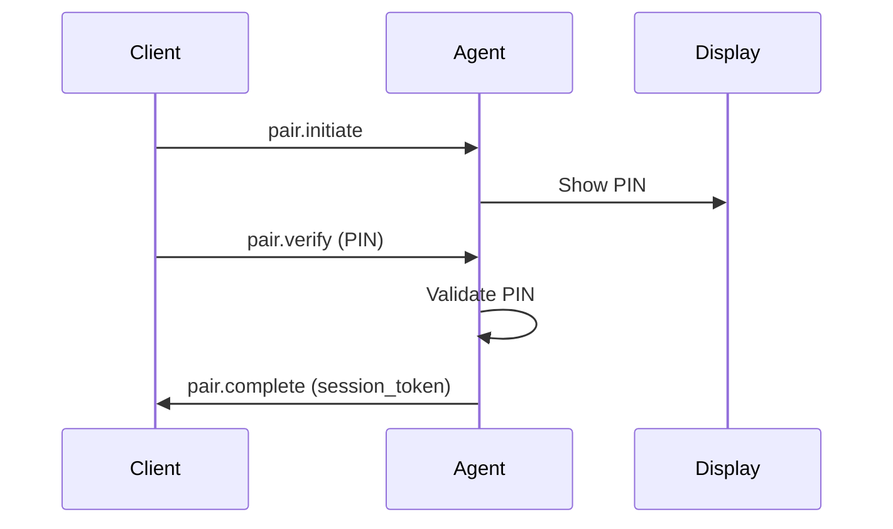

# Documentation Standards

**Good documentation is as important as good code.** BuzzPi's documentation is the primary way users and contributors understand the platform.

---

## Documentation Types

BuzzPi maintains several documentation categories, each with its own audience and format:

| Type | Audience | Format | Location |
|------|----------|--------|----------|
| Reference | All users | Markdown | `books/reference/` |
| Architecture | Developers | Markdown + diagrams | `books/engineering/` |
| Protocol | Implementers | Markdown + JSON Schema | `books/protocol/` |
| Guides | End users | Markdown + screenshots | `books/guides/` |
| Tutorials | New users | Markdown + examples | `books/tutorials/` |
| RFCs | Contributors | Markdown (template) | `rfcs/` |
| API docs | Plugin devs | Generated code docs | SDK packages |
| Design docs | Designers | Figma + design tokens | `books/experience/` |

---

## Writing Style

### General Principles

- **One idea per paragraph.** If you need more than 3 sentences, restructure
- **Use active voice.** "The Agent sends a response" not "A response is sent by the Agent"
- **Be specific.** "The PIN is 6 digits" not "The PIN is a few digits"
- **Show, don't just tell.** Include examples, code snippets, and diagrams
- **Lead with the most important information.** Put the conclusion first

### Headings

- Use sentence case: "Device discovery via mDNS" not "Device Discovery Via M-D-N-S"
- Headings should be descriptive: "How Pairing Works" not "Overview"
- Include an anchor ID for long documents: `## How Pairing Works {#pairing}`
- Maximum heading depth: 4 levels (`####`)

### Lists

- Use numbered lists for sequential steps (tutorials, procedures)
- Use bullet lists for non-sequential items (options, features, requirements)
- Start each list item with a capital letter
- End each list item with a period if it's a complete sentence

### Links

```markdown
Text links: See [RFC-0001](../rfcs/RFC-0001-connection-engine.md) for details.
Reference links: See the [Connection Engine][rfc-0001] specification.
```

- Use descriptive link text: "See the pairing protocol specification" not "Click here"
- Use relative paths for intra-repo links
- Check links when files are moved or renamed

### Code Blocks

- Specify the language for syntax highlighting
- Include a title for context when needed

````markdown
```go title="agent/internal/device/identity.go"
func GenerateIdentity() (*Identity, error) {
    pub, priv, err := ed25519.GenerateKey(nil)
    // ...
}
```
````

- Use `...` for omitted code in examples
- Keep examples runnable where possible

---

## Document Structure

### Reference Documents

```markdown
# Title

Brief description of what this document covers.

---

## Section 1

### Subsection 1.1

Content.
```

### Tutorials

```markdown
# Tutorial Title

**Time to complete:** X minutes
**Prerequisites:** A, B, C

## Step 1: Do First Thing

Instructions...

## Step 2: Do Next Thing

Instructions...
```

### Guides

```markdown
# Guide Title

## Background
Why this exists, what problem it solves.

## Prerequisites
What the reader needs before starting.

## Steps
Step-by-step instructions.

## Troubleshooting
Common issues and solutions.

## Related
Links to related documentation.
```

---

## Diagrams

### When to Use Diagrams

Use diagrams for:
- Architecture overviews (component relationships)
- Data flows (request/response sequences)
- State machines (connection lifecycle, pairing flow)
- Network topology (LAN, relay, direct connection)

### Diagram Format

BuzzPi uses **Mermaid** for diagrams in Markdown:

````markdown

````

ASCII art is acceptable for simple diagrams in RFCs and code comments.

---

## Content Quality Standards

### Every Document Must Have

- [ ] A clear title
- [ ] A one-paragraph description of what the document covers
- [ ] Section headings that make the document scannable
- [ ] No broken links
- [ ] No placeholder text ("TODO", "FIXME", "coming soon")

### Every Tutorial Must Have

- [ ] Estimated completion time
- [ ] Prerequisites clearly stated
- [ ] Numbered steps
- [ ] Expected output at each step
- [ ] Troubleshooting section

### Every Reference Document Must Have

- [ ] A table of contents (if longer than 5 sections)
- [ ] Examples for every API/method/configuration
- [ ] Default values shown
- [ ] Error codes documented

---

## Maintenance

### Review Cadence

| Type | Review Frequency | Responsible |
|------|-----------------|-------------|
| Reference docs | Every release | Documentation maintainer |
| Tutorials | Every release | Feature owner |
| RFCs | Once (upon decision) | RFC author |
| API docs | With code changes | Developer |
| Architecture docs | When architecture changes | Engineering lead |

### Obsolete Content

When content becomes outdated:
1. Mark with a notice: `> **Outdated:** This document describes an older version of the protocol.`
2. Update or archive within one release cycle
3. If a document is replaced, add a redirect note pointing to the new location

---

## Tooling

BuzzPi uses:

- **Markdown** — All documentation (`.md` files)
- **Mermaid** — Diagrams in documentation
- **markdownlint** — Style and formatting checks (CI)
- **markdown-link-check** — Link validation (CI)
- **Spellcheck** — American English spelling (CI)

### Running Checks

```bash
# Check all markdown files
npx markdownlint-cli 'books/**/*.md' 'rfcs/**/*.md'

# Check all links
npx markdown-link-check 'books/**/*.md'

# Check spelling
npx cspell 'books/**/*.md'
```

All documentation checks must pass before merge.
