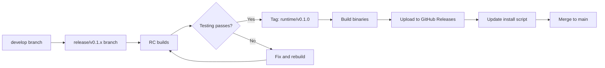
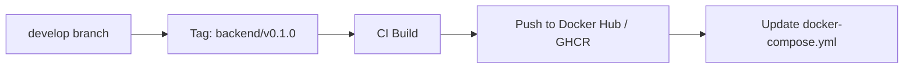
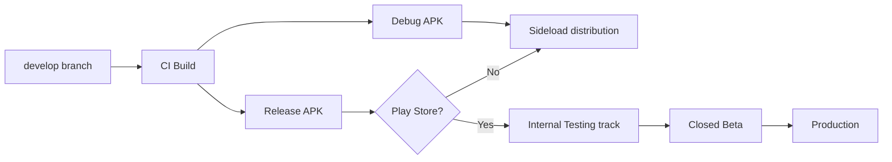

# Release Strategy

**Versioning, cadence, and distribution for the BuzzPi Platform.** This document defines how BuzzPi versions are numbered, what each version means, how releases are distributed, and the branching strategy across all components.

---

## Versioning Scheme

BuzzPi uses [Semantic Versioning 2.0](https://semver.org/) with a platform-specific interpretation:

```
MAJOR.MINOR.PATCH[-prerelease]
```

### Pre-1.0 Convention

Before v1.0.0, the convention differs from standard semver:

| Component | Meaning |
|-----------|---------|
| **v0.0.x** | Foundation — architecture, books, RFCs, governance. No functional code. |
| **v0.1.x** | Proofs of concept — individual components proto-typed in isolation. |
| **v0.2.x** | First end-to-end system — Runtime ↔ Android connecting. |
| **v0.5.x** | Feature-complete MVP — all core features work. |
| **v0.9.x** | Release candidates — stabilization, plugin API freeze, community preview. |
| **v1.0.0** | Stable public release with BPP 1.0. |

### Post-1.0 Convention

| Bump | When | Example |
|------|------|---------|
| **MAJOR** | Breaking BPP protocol change, incompatible API changes | 1.0.0 → 2.0.0 |
| **MINOR** | New features, backwards-compatible BPP additions (new methods) | 1.0.0 → 1.1.0 |
| **PATCH** | Bug fixes, security patches, performance improvements | 1.0.0 → 1.0.1 |

### Pre-release Tags

```
v0.1.0-alpha.1      # Early internal testing
v0.1.0-beta.1       # External developer preview
v0.1.0-rc.1         # Release candidate
```

---

## Component Versioning

Each BuzzPi component is versioned independently. The platform version is a compatibility matrix, not a single number.

| Component | Language | Version Source | Releases |
|-----------|----------|---------------|----------|
| **Runtime** | Go | Git tag: `runtime/v0.1.0` | Binary |
| **Android App** | Kotlin | Git tag: `android/v0.1.0` | APK / Google Play |
| **Backend** | Go | Git tag: `backend/v0.1.0` | Docker image |
| **BPP** | Spec | Git tag: `bpp/1.0.0` | Specification version |
| **SDK** | Go/Kotlin | Git tag: `sdk/v0.1.0` | Module/jitpack |

### Compatibility Matrix

```
Platform v0.1.0
├── Runtime     ≥0.1.0  ∧  ≤0.1.x
├── Android App ≥0.1.0  ∧  ≤0.1.x
├── Backend     ≥0.1.0  ∧  ≤0.1.x
├── BPP         =1.0
└── SDK         ≥0.1.0  ∧  ≤0.1.x
```

During v0.x.y, all components within the same minor version are guaranteed compatible. Across minor versions, components *should* be compatible but are not guaranteed.

---

## Release Cadence

### Pre-1.0

| Phase | Cadence | Artifacts |
|-------|---------|-----------|
| v0.1.x (Prototypes) | Every 2-4 weeks | CLI binaries, debug APK |
| v0.2.x (Integration) | Every 4-6 weeks | APK, docker-compose |
| v0.5.x (MVP) | Every 6-8 weeks | APK, Docker images, SDK snapshots |
| v0.9.x (RC) | Every 2-4 weeks | Play Store beta, Docker tags, SDK release candidates |

### Post-1.0

| Release Type | Cadence | Examples |
|-------------|---------|----------|
| **Major** | Every 12-18 months | 1.0.0 → 2.0.0 |
| **Minor** | Every 3-4 months | 1.0.0 → 1.1.0 → 1.2.0 |
| **Patch** | As needed (security: <24h) | 1.0.0 → 1.0.1 |
| **Hotfix** | Critical bug: <48h | 1.0.1 → 1.0.2 |

---

## Release Process

### Pre-Release Checklist

```
□ All P0 and P1 requirements complete
□ No open P0 bugs
□ Test coverage ≥80%
□ All integration tests passing
□ Security audit passed (for v0.5.0+)
□ Android APK built and tested on reference devices
□ Runtime binary built for: linux/arm, linux/arm64, linux/amd64
□ Backend Docker image built and pushed
□ CHANGELOG.md updated with release notes
□ Version tags pushed to repository
□ Install script updated (for Runtime)
□ Upgrade path tested (from previous version)
□ Release notes written
```

### Runtime Release Flow



### Backend Release Flow



### Android Release Flow



---

## Distribution Channels

### Runtime

| Channel | Method | Audience |
|---------|--------|----------|
| **Install script** | `curl -sS https://get.buzzpi.dev | bash` | All users (primary) |
| **GitHub Releases** | Pre-built binaries per architecture | Developers, CI |
| **APT repository** | `apt install buzzpi-runtime` (future) | ARM Linux users |
| **Docker** | `docker run buzzpi/runtime` (future) | Container users |
| **Build from source** | `go build ./cmd/runtime` | Contributors |

### Android App

| Channel | Method | Audience |
|---------|--------|----------|
| **GitHub Releases** | APK artifact | Pre-1.0 testers |
| **Sideload** | Direct APK install | Developers |
| **Google Play** | Internal Testing → Closed Beta → Production | All users |
| **F-Droid** | Open-source app store (future) | Privacy-conscious users |

### Backend

| Channel | Method | Audience |
|---------|--------|----------|
| **Docker Hub** | `buzzpi/backend:tag` | Self-hosters |
| **GitHub Container Registry** | `ghcr.io/buzzpi/backend:tag` | Self-hosters |
| **docker-compose.yml** | Pre-configured stack | Quick start |
| **Helm chart** | Kubernetes deployment (future) | Enterprise |

---

## Branching Strategy

```
main                    ───●─────────────────●─────────
                         ▲   ┌──────────┐    ▲
                         │   │ v0.1.0   │    │ v0.1.1
                         │   └──────────┘    │
develop                 ●───●────●────●──────●─────────
                         \   \    \    \      \
feature/terminal         └───┴────┴────┴──────┴───────
```

| Branch | Purpose | Base |
|--------|---------|------|
| `main` | Stable releases. Only merge from `develop` or `release/*`. Protected. | — |
| `develop` | Integration branch for all features. Must pass CI. | `main` |
| `feature/*` | Individual features. Branch from `develop`, merge back. | `develop` |
| `release/*` | Release preparation. Bug fixes only, no new features. | `develop` |
| `hotfix/*` | Critical production fixes. Branch from `main`, merge to both `main` and `develop`. | `main` |

### Commit Convention

```
<type>(<scope>): <description>

[optional body]

[optional footer]
```

Types: `feat`, `fix`, `docs`, `style`, `refactor`, `test`, `chore`, `security`

Examples:
```
feat(runtime): add mDNS service advertisement
fix(android): handle terminal ANSI escape sequence for cursor movement
docs(protocol): clarify ICE candidate exchange timeout
security(backend): add rate limiting to auth endpoint
```

---

## Upgrade Strategy

### Runtime Upgrades

During v0.x.y, the Runtime upgrades in-place:

1. New binary downloaded to `/usr/local/bin/buzzpi-runtime`
2. Systemd service restarted: `systemctl restart buzzpi-runtime`
3. Existing session data preserved in `/var/lib/buzzpi/`
4. Configuration file (`/etc/buzzpi/config.yaml`) automatically migrated

```bash
# Automatic upgrade (future)
buzzpi-runtime upgrade

# Manual upgrade
curl -sS https://get.buzzpi.dev | bash
```

### Android App Upgrades

- Sideload distribution: user downloads new APK and installs over existing
- Play Store distribution: automatic updates via Play Store

### Backend Upgrades

- Database migrations run automatically on startup
- Migrations are additive only (no destructive schema changes in v0.x.y)
- Rolling upgrade supported for production deployments

---

## Deprecation Policy

### BPP Protocol Deprecation

1. A BPP method or field is **deprecated** in a minor version (e.g., 1.0 → 1.1)
2. The deprecated element remains functional for **2 minor versions** (e.g., 1.1 → 1.3)
3. A warning response is returned when a deprecated method is used:
   ```json
   {"code": "METHOD_DEPRECATED", "message": "terminal.legacy_write is deprecated. Use terminal.write (introduced in BPP 1.1). Will be removed in BPP 1.3."}
   ```
4. The element is **removed** in the next major version (e.g., 2.0)

### Runtime Feature Deprecation

1. Deprecated in release notes and CHANGELOG
2. Warning logged at Runtime startup for 2 minor versions
3. Feature removed in next major version

---

## Release Naming

Each minor release (v0.1.x, v0.2.x) gets a code name from the periodic table of elements:

| Version | Code Name | Theme |
|---------|-----------|-------|
| v0.1.x | **Helium** | Lightweight. It floats. Proves the concept. |
| v0.2.x | **Carbon** | The building block of life. Add substance. |
| v0.3.x | **Neon** | Lights up. Visibility. Polish. |
| v0.5.x | **Iron** | Sturdy. Reliable. Ready for work. |
| v0.9.x | **Platinum** | Precious. Almost final. |
| v1.0.0 | **Gold** | The stable release. |

---

## Milestone Commitments

### v0.1.0 — Helium

**Target:** Proof-of-concept prototype

| Component | Commitment |
|-----------|------------|
| Runtime | mDNS, WebSocket client, PTY terminal, pairing code, system stats |
| Android | Discovery, pairing, terminal view, reconnection |
| Backend | Registry (auth + device CRUD), WebSocket relay, TURN credentials |
| BPP | Core methods: device, terminal, capabilities (subset) |

### v0.2.0 — Carbon

**Target:** Feature expansion

| Component | Commitment |
|-----------|------------|
| Runtime | Screen capture (DRM), camera, GPIO, Docker socket |
| Android | Screen streaming, file manager, GPIO control, camera viewer |
| Backend | Notification service, multi-device support |
| BPP | All service methods |

### v0.3.0 — Neon

**Target:** Extensibility

| Component | Commitment |
|-----------|------------|
| Runtime | Plugin system, IPC protocol |
| Android | Plugin UI rendering, permission management |
| SDK | Go + Kotlin SDK for plugin development |
| BPP | Extension methods finalized |

### v0.5.0 — Iron

**Target:** Feature-complete MVP

| Component | Commitment |
|-----------|------------|
| Runtime | BuzzAI, self-update, resource limits |
| Android | AI assistant UI, push notifications |
| Desktop | Electron or Tauri desktop client prototype |
| CLI | Go CLI client |
| BPP | BuzzAI methods, all methods stable |

### v1.0.0 — Gold

**Target:** Stable public release

- BPP 1.0 specification frozen
- All components ≥1.0.0
- Security audit completed
- Documentation complete (user guides, API docs, plugin SDK docs)
- Community governance established
- 100+ unit/integration tests per component
- Performance benchmarks published
